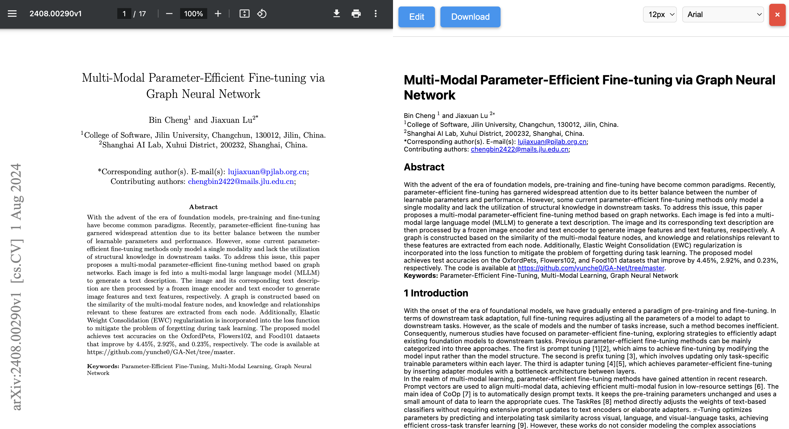

# Paperbridge

Welcome to the Paperbridge project! This repository provides the source code and resources for Paperbridge, a tool designed to enhance the accessibility and usability of scientific documents by converting PDFs to Mathpix Markdown (MMD) and allowing for editing and exporting via a browser extension. 

**Follow this links for detailed overview of the project** [documentaion](https://5rijan.github.io/paperbridge-docs/)




## Overview

Paperbridge addresses the limitations of PDFs by converting them into MMD, a markup language that maintains the document's structural and semantic integrity. This process includes:

- **PDF Conversion**: Utilizing Nougat AI for accurate extraction of text, mathematical expressions, and figures.
- **Image and Metadata Extraction**: Employing PDFFigures 2.0 for precise extraction of images and their associated metadata.
- **Editing and Exporting**: Using the Paperbridge browser extension to edit and export documents in MMD and HTML formats, with features like customizable font sizes, dark mode, and integrated translation.

## Key Features

- **Nougat AI**: Advanced model for converting PDFs into MMD with superior accuracy in mathematical and tabular data extraction.
- **PDFFigures 2.0**: High-precision tool for extracting figures, tables, and metadata from scientific documents.
- **Paperbridge Extension**: User-friendly browser extension for editing MMD documents, inserting images and tables, and exporting to HTML and PDF.

## Getting Started

To get started with Paperbridge:

1. **Clone the Repository**:
   ```bash
   git clone https://github.com/5rijan/PaperBridge.git
   ```

2. **Install Dependencies**:
    Follow the installation instructions provided in the online [documentation](https://5rijan.github.io/paperbridge-docs/)


## Contributing 
This is a open source project and we welcome any contributions to the Paperbridge project!

## Research and Projects
If you are interested in including Paperbridge in your research or projects, please reach out to us. We would love to collaborate and support the advancement of scientific document accessibility. Contact us via email at srijanchaudhary2003@gmail.com for more information.

## License
This project is licensed under the MIT License.


